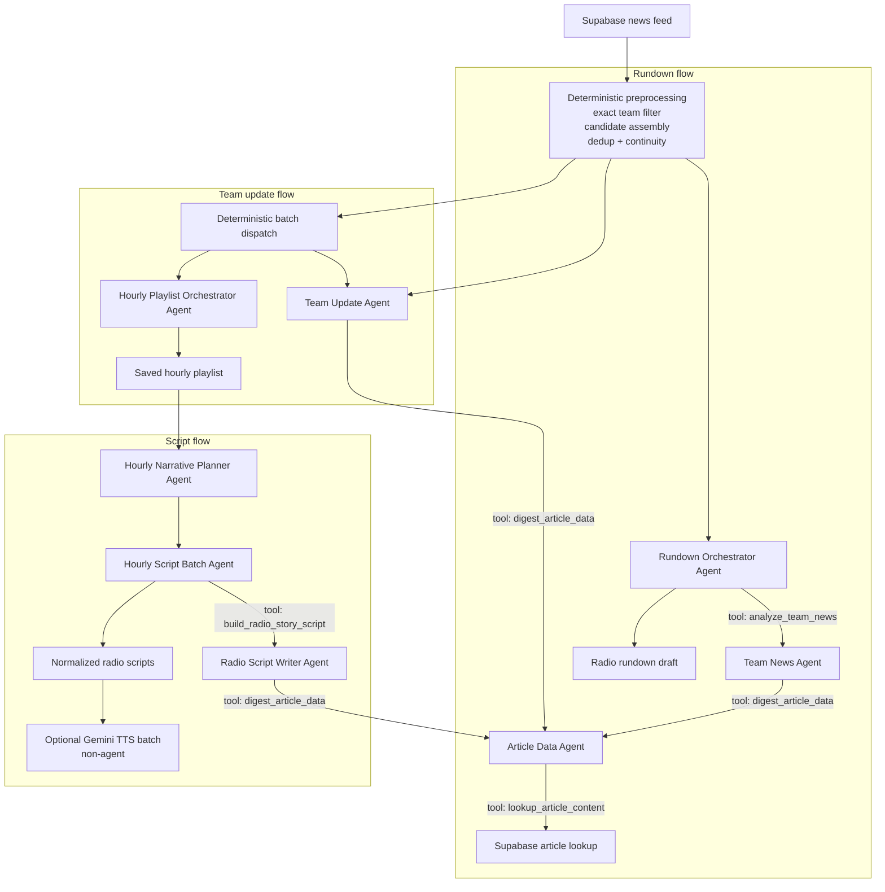
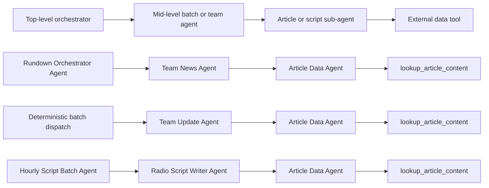
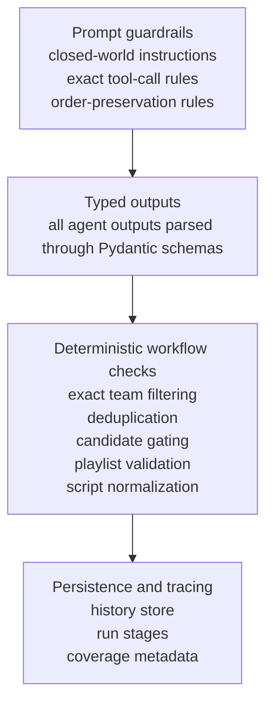
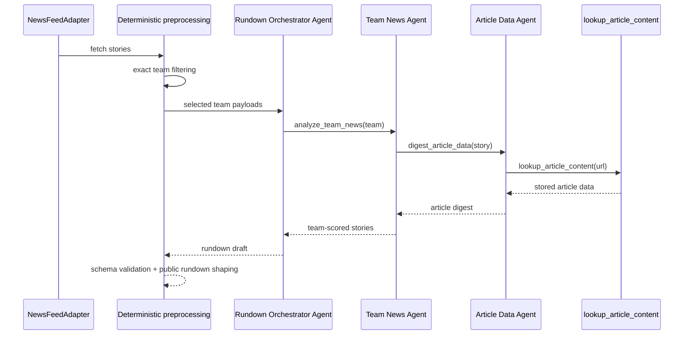
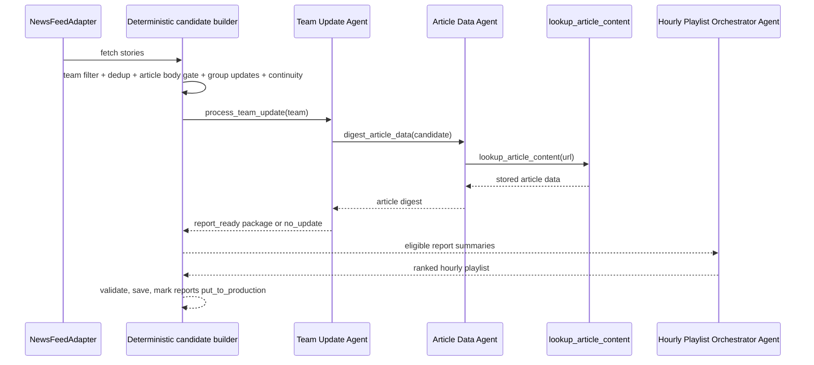
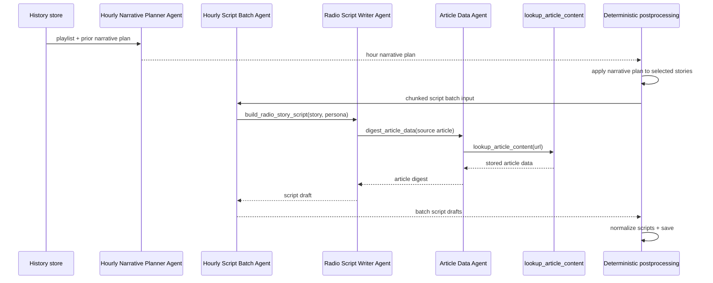

# Agents Documentation

This document describes the current agent system in the repository, including:

- every real OpenAI Agents SDK agent instance
- the tool each agent uses
- the model setting each agent resolves through
- the prompt entry each agent reads from [`app/newsroom/prompts.yml`](app/newsroom/prompts.yml)
- the workflow connections, handoffs, and guardrails around those agents

## Quick Inventory

There are currently 8 active SDK agent types, 1 inactive builder definition, and 3 localized runtime variants.

### Active SDK agent types

| Agent | Builder | Default model | Tool(s) | Prompt |
| --- | --- | --- | --- | --- |
| Article Data Agent | [`build_article_data_agent`](app/newsroom/agents.py) | `openai_model_article_data_agent` -> `gpt-5-mini-2025-08-07` | `lookup_article_content` | [`article_data_agent`](app/newsroom/prompts.yml) |
| Team News Agent | [`build_team_news_agent`](app/newsroom/agents.py) | `openai_model_team_news_agent` -> `gpt-5-2025-08-07` | `digest_article_data` | [`team_news_agent`](app/newsroom/prompts.yml) |
| Rundown Orchestrator Agent | [`build_rundown_orchestrator_agent`](app/newsroom/agents.py) | `openai_model_rundown_orchestrator_agent` -> `gpt-5.2-2025-12-11` | `analyze_team_news` | [`rundown_orchestrator_agent`](app/newsroom/prompts.yml) |
| Team Update Agent | [`build_team_update_agent`](app/newsroom/agents.py) | `openai_model_team_update_agent` -> `gpt-5-mini-2025-08-07` | `digest_article_data` | [`team_update_agent`](app/newsroom/prompts.yml) |
| Hourly Playlist Orchestrator Agent | [`build_hourly_playlist_orchestrator_agent`](app/newsroom/agents.py) | `openai_model_hourly_playlist_orchestrator_agent` -> `gpt-5.2-2025-12-11` | none | [`hourly_playlist_orchestrator_agent`](app/newsroom/prompts.yml) |
| Hourly Narrative Planner Agent | [`build_hourly_narrative_planner_agent`](app/newsroom/agents.py) | `openai_model_hourly_narrative_planner_agent` -> `gpt-5.4-2026-03-05` | none | [`hourly_narrative_planner_agent`](app/newsroom/prompts.yml) |
| Radio Script Writer Agent | [`build_radio_script_writer_agent`](app/newsroom/agents.py) | `openai_model_radio_script_writer_agent` -> `gpt-5.3-chat-latest` | `digest_article_data` | [`radio_script_writer_agent`](app/newsroom/prompts.yml) |
| Hourly Script Batch Agent | [`build_hourly_script_batch_agent`](app/newsroom/agents.py) | `openai_model_hourly_script_batch_agent` -> `gpt-5-mini-2025-08-07` | `build_radio_story_script` | [`hourly_script_batch_agent`](app/newsroom/prompts.yml) |

### Inactive builder definition

| Agent | Builder | Default model | Tool(s) | Prompt |
| --- | --- | --- | --- | --- |
| Team Update Batch Agent | [`build_team_update_batch_agent`](app/newsroom/agents.py) | `openai_model_team_update_batch_agent` -> `gpt-5-mini-2025-08-07` | `build_team_update_package` | [`team_update_batch_agent`](app/newsroom/prompts.yml) |

This builder remains in the codebase, but [`app/newsroom/workflow_team_update.py`](app/newsroom/workflow_team_update.py) currently dispatches batch runs deterministically via `process_team_update(...)` instead of instantiating this agent.

### Localized runtime variants

These are real runtime `Agent(...)` instances created in [`app/newsroom/workflow_team_update.py`](app/newsroom/workflow_team_update.py), but they reuse the same builder functions.

| Runtime agent instance | Based on | Default model | Tool(s) | Prompt |
| --- | --- | --- | --- | --- |
| `Hourly Narrative Planner Agent (de-DE)` | `Hourly Narrative Planner Agent` | `openai_model_hourly_narrative_planner_agent` -> `gpt-5.4-2026-03-05` | none | [`hourly_narrative_planner_agent`](app/newsroom/prompts.yml) |
| `Radio Script Writer Agent (de-DE)` | `Radio Script Writer Agent` | `openai_model_radio_script_writer_agent` -> `gpt-5.3-chat-latest` | `digest_article_data` | [`radio_script_writer_agent_de_de`](app/newsroom/prompts.yml) |
| `Hourly Script Batch Agent (de-DE)` | `Hourly Script Batch Agent` | `openai_model_hourly_script_batch_agent` -> `gpt-5-mini-2025-08-07` | `build_radio_story_script` | [`hourly_script_batch_agent_de_de`](app/newsroom/prompts.yml) |

### Names that are not separate agents

The following names exist in config as role-model aliases or fallbacks, not as standalone `Agent(...)` definitions:

- `chief_editor`
- `team_analyst`
- `story_researcher`

See [`app/config.py`](app/config.py) for the fallback mapping.

## Visual Overview

### Full system map



### Nested handoff depth



### Guardrail layers



## Agent-by-Agent Reference

### 1. Article Data Agent

- Runtime name: `Article Data Agent`
- Builder: [`build_article_data_agent`](app/newsroom/agents.py)
- Model: `settings.agent_model("article_data_agent")`
- Default config key: `openai_model_article_data_agent`
- Default value: `gpt-5-mini-2025-08-07`
- Tool: `lookup_article_content`
- Prompt: [`article_data_agent`](app/newsroom/prompts.yml)
- Output schema: `ArticleDigestAgentResult`
- Primary role: digest one exact article URL into a structured summary, key facts, confidence, and content status

What it does:

- Receives one article reference at a time.
- Calls `lookup_article_content` exactly once.
- Produces a closed-world digest from stored Supabase article content.

Handoff:

- Called by `Team News Agent`
- Called by `Team Update Agent`
- Called by `Radio Script Writer Agent`

Guardrails:

- One exact lookup per input article
- No outside NFL knowledge
- Confidence and content status must reflect source quality
- Output must parse into `ArticleDigestAgentResult`

### 2. Team News Agent

- Runtime name: `Team News Agent`
- Builder: [`build_team_news_agent`](app/newsroom/agents.py)
- Model: `settings.agent_model("team_news_agent")`
- Default config key: `openai_model_team_news_agent`
- Default value: `gpt-5-2025-08-07`
- Tool: `digest_article_data`
- Prompt: [`team_news_agent`](app/newsroom/prompts.yml)
- Output schema: `TeamAnalysisResult`
- Primary role: score every prefiltered story for a single team

What it does:

- Receives one team and its story list.
- Calls `digest_article_data` exactly once per story.
- Returns one scored record per input story instead of collapsing to a single winner.

Handoff:

- Called by `Rundown Orchestrator Agent`

Guardrails:

- One scored item for every provided story
- `relevance_score` must stay between `0.0` and `1.0`
- Closed-world writing only
- Empty input yields an empty `scored_stories` list

### 3. Rundown Orchestrator Agent

- Runtime name: `Rundown Orchestrator Agent`
- Builder: [`build_rundown_orchestrator_agent`](app/newsroom/agents.py)
- Model: `settings.agent_model("rundown_orchestrator_agent")`
- Default config key: `openai_model_rundown_orchestrator_agent`
- Default value: `gpt-5.2-2025-12-11`
- Tool: `analyze_team_news`
- Prompt: [`rundown_orchestrator_agent`](app/newsroom/prompts.yml)
- Output schema: `RadioRundownDraft`
- Primary role: build the final one-hour rundown from the full team-scored story pool

What it does:

- Receives selected teams and prefiltered story cards.
- Calls `analyze_team_news` exactly once per team.
- Merges overlapping cross-team stories and produces segments plus backups.

Handoff:

- Top-level agent in the rundown workflow
- Delegates team-level scoring to `Team News Agent`

Guardrails:

- Uses team tool scores as an input signal, not an absolute ranking
- Must keep source article references on every output segment
- Must merge duplicate stories by shared `story_id` or `url`
- Final output is schema-validated and then converted to the public rundown shape

### 4. Team Update Agent

- Runtime name: `Team Update Agent`
- Builder: [`build_team_update_agent`](app/newsroom/agents.py)
- Model: `settings.agent_model("team_update_agent")`
- Default config key: `openai_model_team_update_agent`
- Default value: `gpt-5-mini-2025-08-07`
- Tool: `digest_article_data`
- Prompt: [`team_update_agent`](app/newsroom/prompts.yml)
- Output schema: `TeamUpdateAgentResult`
- Primary role: build one 180-second team update production brief from pre-gated candidate stories

What it does:

- Receives one team and its deterministic candidate list.
- Calls `digest_article_data` exactly once per candidate story.
- Returns `report_ready` with a single package when at least one concrete, team-specific, verifiable update survives digestion.
- Returns `no_update` when the candidates do not support a real on-air update.

Handoff:

- Called directly in single-team update runs
- Called directly by deterministic batch dispatch in [`app/newsroom/workflow_team_update.py`](app/newsroom/workflow_team_update.py)

Guardrails:

- Candidate list is pre-gated before the agent runs
- Deterministically unusable stored article bodies are dropped before the agent sees them
- Output is a production brief, not final script copy
- Must explain what changed when framing is `update`
- Must include source articles that support the central narrative
- Must never produce a meta-package whose real message is missing verification or empty digests

### 5. Team Update Batch Agent Builder

- Runtime name: `Team Update Batch Agent`
- Builder: [`build_team_update_batch_agent`](app/newsroom/agents.py)
- Model: `settings.agent_model("team_update_batch_agent")`
- Default config key: `openai_model_team_update_batch_agent`
- Default value: `gpt-5-mini-2025-08-07`
- Tool: `build_team_update_package`
- Prompt: [`team_update_batch_agent`](app/newsroom/prompts.yml)
- Output schema: `TeamUpdateBatchAgentTransportResult`
- Primary role: available nested batch orchestrator definition; not currently instantiated by the live workflow

What it does:

- Defines the schema-first nested batch path that was previously used for per-team orchestration.
- Preserves order and transport output shape when instantiated.
- Remains available for future runtime variants or experiments.
- The current production workflow does not instantiate this agent.

Handoff:

- If instantiated, it sits between deterministic batch preparation and playlist creation.
- The current production workflow bypasses it and calls `process_team_update(...)` directly for each prepared team.

Guardrails:

- If instantiated, teams with zero candidates must return `no_update`.
- If instantiated, teams with candidates may still return `no_update` after digestion removes airworthy material.
- If instantiated, output order must match input order and nested `report` payloads must be copied exactly from `build_team_update_package`.
- The active workflow instead validates deterministic `TeamUpdateBatchAgentReport` outputs before persistence and playlist creation.

### 6. Hourly Playlist Orchestrator Agent

- Runtime name: `Hourly Playlist Orchestrator Agent`
- Builder: [`build_hourly_playlist_orchestrator_agent`](app/newsroom/agents.py)
- Model: `settings.agent_model("hourly_playlist_orchestrator_agent")`
- Default config key: `openai_model_hourly_playlist_orchestrator_agent`
- Default value: `gpt-5.2-2025-12-11`
- Tool: none
- Prompt: [`hourly_playlist_orchestrator_agent`](app/newsroom/prompts.yml)
- Output schema: `HourlyPlaylistSelection`
- Primary role: choose and rank the strongest hourly production lineup from batch-ready team reports

What it does:

- Receives only the eligible report summaries for the current hour.
- Selects and ranks the hourly playlist.
- Writes concise `production_reason` fields for why each item belongs now.

Handoff:

- Consumes deterministic batch-dispatch outputs from [`app/newsroom/workflow_team_update.py`](app/newsroom/workflow_team_update.py)
- Produces the saved playlist used by script generation

Guardrails:

- Eligible reports are real reportable updates only; skipped teams never reach this stage
- If fewer than 10 eligible reports exist, include all of them
- If 10 or more exist, return 10 to 15 items
- Rank starts at 1 with no gaps
- Playlist selection is validated deterministically before it is saved and used downstream

### 7. Hourly Narrative Planner Agent

- Runtime names: `Hourly Narrative Planner Agent`, `Hourly Narrative Planner Agent (de-DE)`
- Builder: [`build_hourly_narrative_planner_agent`](app/newsroom/agents.py)
- Model: `settings.agent_model("hourly_narrative_planner_agent")`
- Default config key: `openai_model_hourly_narrative_planner_agent`
- Default value: `gpt-5.4-2026-03-05`
- Tool: none
- Prompt: [`hourly_narrative_planner_agent`](app/newsroom/prompts.yml)
- Output schema: `HourlyNarrativePlan`
- Primary role: shape one coherent editorial arc across the saved playlist

What it does:

- Receives stories in playlist order plus an optional prior plan for continuity.
- Returns one hour-wide narrative plan and one segment plan per story.
- Establishes callbacks, handoffs, anti-repetition guidance, and story-thread continuity.

Handoff:

- Consumes the saved hourly playlist
- Feeds narrative context into `Hourly Script Batch Agent`

Guardrails:

- Must preserve playlist order and `playlist_rank` values
- Must supply one segment plan per selected story
- Must make repeated story threads additive instead of repetitive
- Prior plan continuity is advisory, but current ordered playlist stays authoritative

### 8. Radio Script Writer Agent

- Runtime names: `Radio Script Writer Agent`, `Radio Script Writer Agent (de-DE)`
- Builder: [`build_radio_script_writer_agent`](app/newsroom/agents.py)
- Model: `settings.agent_model("radio_script_writer_agent")`
- Default config key: `openai_model_radio_script_writer_agent`
- Default value: `gpt-5.3-chat-latest`
- Tool: `digest_article_data`
- Prompt: [`radio_script_writer_agent`](app/newsroom/prompts.yml), [`radio_script_writer_agent_de_de`](app/newsroom/prompts.yml)
- Output schema: `RadioStoryScriptDraft`
- Primary role: write one single-anchor radio segment for one selected playlist item

What it does:

- Receives one selected story, one persona, hour context, and source references.
- Calls `digest_article_data` exactly once per source article.
- Produces radio-ready intro, body, outro, performance notes, and structured metadata.
- Uses sparse spoken micro-imperfections, longer-then-shorter sentence pacing shifts, and line-level emotional intent to keep delivery human without changing the schema.

Handoff:

- Called by `Hourly Script Batch Agent` through the `build_radio_story_script` tool

Guardrails:

- Every factual statement must trace back to provided inputs or article digests
- Duration cannot exceed 240 seconds
- Narrative context is hard direction, not optional flavor
- The German variant must return the specified writing fields in natural German

### 9. Hourly Script Batch Agent

- Runtime names: `Hourly Script Batch Agent`, `Hourly Script Batch Agent (de-DE)`
- Builder: [`build_hourly_script_batch_agent`](app/newsroom/agents.py)
- Model: `settings.agent_model("hourly_script_batch_agent")`
- Default config key: `openai_model_hourly_script_batch_agent`
- Default value: `gpt-5-mini-2025-08-07`
- Tool: `build_radio_story_script`
- Prompt: [`hourly_script_batch_agent`](app/newsroom/prompts.yml), [`hourly_script_batch_agent_de_de`](app/newsroom/prompts.yml)
- Output schema: `HourlyPlaylistScriptsBatchAgentResult`
- Primary role: assign personas and orchestrate per-story script generation for a saved playlist

What it does:

- Receives playlist stories, a shared hour brief, and the persona roster.
- Assigns one persona to each story.
- Calls `build_radio_story_script` exactly once per story and returns scripts in input order.

Handoff:

- Consumes the output of `Hourly Narrative Planner Agent`
- Delegates per-story writing to `Radio Script Writer Agent`
- Feeds deterministic script normalization and optional TTS

Guardrails:

- Must preserve story order
- Must rotate personas for variety when possible
- Must not rewrite story identity or source selection itself
- Script generation is chunked deterministically via `script_batch_chunk_size`

## Workflow Connections and Handoffs

### Agent-to-agent reference

This section answers one narrow question clearly: when one agent depends on another, who calls whom, through which tool, and for what purpose.

| Caller agent | Tool used | Callee agent | Why the handoff happens |
| --- | --- | --- | --- |
| `Rundown Orchestrator Agent` | `analyze_team_news` | `Team News Agent` | Score one team's candidate stories before the final show rundown is assembled |
| `Team News Agent` | `digest_article_data` | `Article Data Agent` | Turn each source article into a structured digest before assigning team-level relevance |
| `Team Update Agent` | `digest_article_data` | `Article Data Agent` | Ground each candidate update story in article-level facts before writing the package |
| `Hourly Script Batch Agent` | `build_radio_story_script` | `Radio Script Writer Agent` | Write one radio segment per selected playlist story |
| `Radio Script Writer Agent` | `digest_article_data` | `Article Data Agent` | Re-digest each source article so final script copy stays source-grounded |

### Practical examples

#### Example 1: one rundown segment

If the rundown flow is deciding whether a Bills story belongs in the hour:

1. `Rundown Orchestrator Agent` receives the Bills team payload.
2. It calls `analyze_team_news`.
3. That tool runs `Team News Agent`.
4. `Team News Agent` calls `digest_article_data` once per Bills story.
5. That tool runs `Article Data Agent`.
6. `Article Data Agent` calls `lookup_article_content` and returns a structured digest.
7. `Team News Agent` returns scored Bills story candidates.
8. `Rundown Orchestrator Agent` compares those scored candidates against the rest of the league and decides whether that Bills story becomes a segment or a backup.

Short form:

```text
Rundown Orchestrator Agent
  -> analyze_team_news
  -> Team News Agent
  -> digest_article_data
  -> Article Data Agent
  -> lookup_article_content
```

#### Example 2: one final radio script

If the script flow is writing the #3 story in the saved hourly playlist:

1. `Hourly Script Batch Agent` assigns a persona to playlist item 3.
2. It calls `build_radio_story_script`.
3. That tool runs `Radio Script Writer Agent`.
4. `Radio Script Writer Agent` calls `digest_article_data` once for each source article behind that playlist item.
5. `Article Data Agent` re-digests those sources from stored article content.
6. `Radio Script Writer Agent` writes the final structured script draft.
7. `Hourly Script Batch Agent` returns that draft in the same playlist order as the input batch.

Short form:

```text
Hourly Script Batch Agent
  -> build_radio_story_script
  -> Radio Script Writer Agent
  -> digest_article_data
  -> Article Data Agent
  -> lookup_article_content
```

### Rundown workflow



### Team update and hourly playlist workflow



### Script workflow



## Deterministic Guardrails Outside the Agents

These guardrails are just as important as the prompt instructions because they constrain what reaches the agents and what is accepted after they respond.

### Pre-agent guardrails

- Exact team filtering happens in Python helpers and workflow code before the team-level agents run.
- Team update candidate construction is deterministic: deduplication, article lookup presence checks, `group_id` requirement, group update lookup, fallback update handling, and continuity framing all happen before `Team Update Agent` sees input.
- Batch and script work are chunked deterministically via config values in [`app/config.py`](app/config.py).

### During-agent guardrails

- Nested agent calls are routed through tool wrappers in [`app/newsroom/tools.py`](app/newsroom/tools.py).
- Tool wrappers coerce outputs into typed schemas immediately after each nested run.
- Several prompts require exact call counts such as "call exactly once for every provided story" or "exactly once for that story."

### Post-agent guardrails

- All `Runner.run(...)` outputs are validated through `coerce_output(...)` before downstream use.
- Rundown output is reshaped into the public response format only after schema validation.
- Hourly playlist selections are validated before saving and production marking.
- Script drafts are normalized against playlist order, persona roster, and narrative context before persistence.

## File Map

Use these files when the agent system changes:

- Agent builders: [`app/newsroom/agents.py`](app/newsroom/agents.py)
- Agent tools and nested handoffs: [`app/newsroom/tools.py`](app/newsroom/tools.py)
- Prompt text: [`app/newsroom/prompts.yml`](app/newsroom/prompts.yml)
- Prompt loading: [`app/newsroom/prompts.py`](app/newsroom/prompts.py)
- Model defaults and fallbacks: [`app/config.py`](app/config.py)
- Rundown workflow assembly: [`app/newsroom/workflow_rundown.py`](app/newsroom/workflow_rundown.py)
- Team update, playlist, and script workflows: [`app/newsroom/workflow_team_update.py`](app/newsroom/workflow_team_update.py)

## Maintenance Rule

If any of the following change, this file must be updated in the same patch:

- a new agent is added
- an agent is removed or renamed
- an agent changes model mapping
- an agent changes tool wiring
- an agent changes prompt key
- a workflow handoff or nesting pattern changes
- a deterministic guardrail changes the effective agent contract
